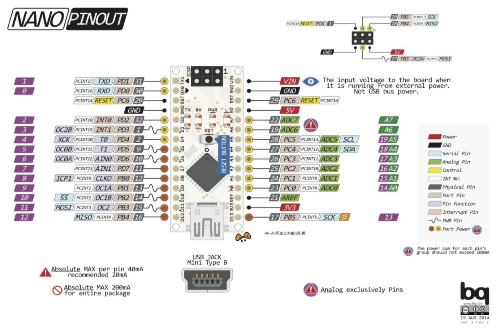
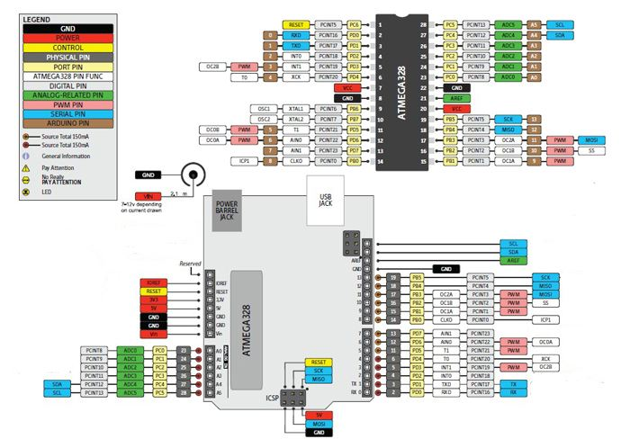
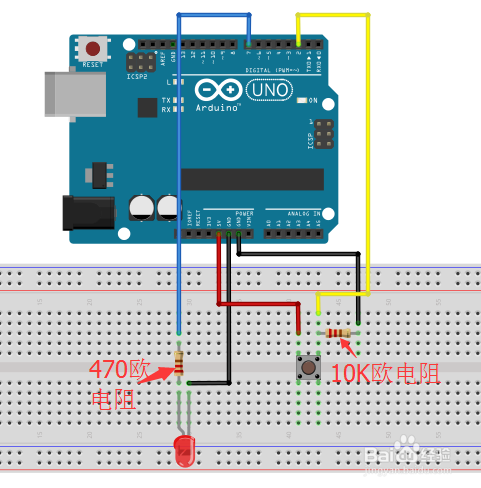
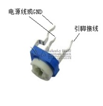

# arduino

## 定义引脚

```c
setup(){}//定义初始化，如引脚的输入输出
loop(){}//用来定义整个芯片主要重复动作的区域
unsigned int/long//无符号整型/长整型
int a[3]={1,5,4}//数组
pinMode(pin, mode);//数字I0口输入输出模式定义函数，pin表示为0~13，mode表示为INPUT或OUTPUT。
digitalWrite(pin, value);//数字IO口输出电平定义函数，pin表示为0~13，value表示为HGH或LOW。比如定义HIGH可以驱动LED。
digtulRead(pin);//数字I0口读输入电平函数，pin 表示为0~13, value表示为HIGH或LOW。比如可以读数字传感器。
analogRead(pin);//模拟IO口读函数，pin 表示为0~5 (Arduino Dieaimila为0~5，Arduino nano为0~7)。比如可以读模拟传感器(10位AD，0~5V表示为0~1023)。
analogWrite(pin, value);//PWM数字I0口PWM输出函数，Arduino数字I0口标注了PWM的IO口可使用该函数，pin表示3,5,6, 9, 10, value表示为0~255。比如可用于电机PWM调速或音乐播放。
```

## 时间函数

```c
delay(ms) //延时函数(单位ms)。
delayMicroneconds(us) //延时函数(单位us)。
```

## 数学函数

```c
min(x, y) //求最小值,max(x, y)：求最大值,abs(x)：计算绝对值。
constrain(x,a,b) //若x<a,则返回a；若a<x<b,则返回x；若x>b,则返回b。
map(salue, fromlow, fromHigh, tolow, toHigh) //约束函数，value 必须在fromlow与tolow之间和fromHigh与toHigh之间。
long random(min,max) //在此区间产生一个随机数，最小值默认为0。
pow(hase, exponent) //开方函数，base 的exponent次方。
sq(x) //平方
sqrt(x) //开根号
```

## 引脚图

- nano原理图



- uno原理图



- 按钮接法



- 电位器



## 电子器件控制

- 超声波传感器

```c
#define LED A5
void setup(){
  pinMode(A3, INPUT); //接传感器的Echo引脚
  pinMode(A4, OUTPUT);//接传感器的Trlg引脚
  pinMode(LED,OUTPUT);//定义A5为LED输出引脚
  Serial.begin(9600);//开始频率
}
void loop(){
  digitalWrite(A4, LOW);
  delayMicroseconds(2);
  digitalWrite(A4, HIGH);
  delayMicroseconds(10);
  digitalWrite(A4, LOW);
  float distance = pulseIn(A3, HIGH) / 58.00;
  delay(10); 
  Serial.println(distance);
  if(distance<20){  //当距离小于20cm时，点亮LED
    digitalWrite(LED,HIGH);
  }
  else{
    digitalWrite(LED,LOW);
  }
}
```

- 操纵杆

```c
#define LED A6
#define LED1 A2
#define LED2 A1
#define LED3 A0
int value = A3; 
void setup() { 
 pinMode(A7, INPUT_PULLUP); 
 pinMode(LED,OUTPUT);
 pinMode(LED1,OUTPUT);
 pinMode(LED2,OUTPUT);
 pinMode(LED3,OUTPUT);
 Serial.begin(9600); 
} 
void loop(){
 value = analogRead(A3); 
 Serial.print("X:"); 
 Serial.print(value, DEC); 
 value = analogRead(A4); 
 Serial.print(" | Y:"); 
 Serial.print(value, DEC); 
 value = digitalRead(A7); 
 Serial.print(" | Z: "); 
 Serial.println(value, DEC); 
 delay(100); 
 if(analogRead(A3) > 800){
  digitalWrite(LED1,HIGH);
 }
 else{
  digitalWrite(LED1,LOW);
 }
 if(analogRead(A3) < 300){
  digitalWrite(LED3,HIGH);
 }
 else{
  digitalWrite(LED3,LOW);
 }
 if(analogRead(A4) > 800){
  digitalWrite(LED2,HIGH);
 }
 else{
  digitalWrite(LED2,LOW);
 }
  if(analogRead(A4) < 300){
  digitalWrite(LED,HIGH);
 }
 else{
  digitalWrite(LED,LOW);
 }
}
```

- 电机

```c
int motorPin = 9; //定义电机连接引脚
void setup()
{
  pinMode(motorPin, OUTPUT);
}
void loop()
{
  //motorOnThenOff();
  //motorOnThenOffWithSpeed();
  motorAcceleration();
}
//关闭电机
void motorOnThenOff(){
  int onTime = 2500; //调节开关占空比，也可使用PWM模拟输出方式
  int offTime = 1000;

  digitalWrite(motorPin, HIGH);
  delay(onTime);
  digitalWrite(motorPin, LOW);
  delay(offTime);
}
//电机以特定速度启停
void motorOnThenOffWithSpeed(){
  int onSpeed = 200;
  int onTime = 2500;
  int offSpeed = 50;
  int offTime = 1000;
  analogWrite(motorPin, onSpeed);
  delay(onTime);
  analogWrite(motorPin, offSpeed);
  delay(offTime);
}
//电机变速
void motorAcceleration(){
  int delayTime = 50; //调整速度的时间间隔
  //电机加速
  for(int i = 0; i < 256; i++){
    analogWrite(motorPin, i);
    delay(delayTime);
  }
  //电机减速
  for(int i = 255; i >= 0; i--){
    analogWrite(motorPin, i);
    delay(delayTime);
  }
}
```

- 红外线

```c
#include <IRremote.h>
int RECV_PIN = 3;
IRrecv irrecv(RECV_PIN);
decode_results results; // 用于存储编码结果的对象
void setup()
{
  Serial.begin(9600); // 初始化串口通信
  irrecv.enableIRIn(); // 初始化红外解码
}

void loop() {
  if (irrecv.decode(&results)) {
    //Serial.println(results.value,HEX);
    Serial.println(results.value);
    delay(500);
    irrecv.resume(); // 接收下一个编码
  }
}
```

- 蓝牙

```c
#include <SoftwareSerial.h>
SoftwareSerial BT(11, 10); 
char a;
void setup()  {
  pinMode(A0, OUTPUT);
  BT.begin(9600);
}
void loop() {
  if (BT.available()){
    a = (BT.read());
    if (a=='1'){
      digitalWrite(A0,HIGH);
    }
    if (a=='2'){
      digitalWrite(A0,LOW);
    }
  }
}
```

- 声音传感器

```c
int micPin = A4;//麦克风型号输入端口
int ledPin = A3;//LED端口
int micVal = 0;//麦克风音量值
boolean toggle = false;//LED的状态。默认为不量
void setup(){
  pinMode(ledPin,OUTPUT);//LED端口设置为“输出”
  Serial.begin(9600);
}
void loop(){
  //读取麦克风的音量，此电路的最高值为790
  micVal = analogRead(micPin);
  //如果音量大于500
  if (micVal > 500){
    //显示音量值
    Serial.println(micVal);
    toggle = !toggle;
    //如果toggle的值是true
    if (toggle){
      digitalWrite(ledPin,HIGH);//LED点亮
    }else{
      digitalWrite(ledPin,LOW);//LED熄灭
    }
    delay(500);
  }
}
```

## 项目实战

- 舵机自学机械臂

```c
#include <Servo.h> //舵机头文件
Servo servo_0,servo_1,servo_2,servo_3; //定义4个舵机
int sensorPin0 = A4,sensorPin1 = A5,sensorPin2 = A6,sensorPin3 = A7;  //电位器阻值输入口
int SensVal_0,SensVal_1,SensVal_2,SensVal_3; //电位器临时值
boolean playmode = false; //模式判断
float angle0[30],angle1[30],angle2[30],angle3[30]; // 角度存储数组
float dif[4],temp[4];
int i,j,k,stepsMax,num=0,num1=0,key_value,del;
void setup() {
  pinMode(2, INPUT);  // 按钮输入口
  servo_0.attach(A0); servo_1.attach(A1);
  servo_2.attach(A2);servo_3.attach(A3); // 连接舵机
  Serial.begin(9600); 
}
void loop() {
  if(playmode == false) {        //学习模式
    SensVal_1 = analogRead(sensorPin1); //读取电位器阻值
    SensVal_1 = map(SensVal_1, 0, 1024, 500, 2500);//将电位器阻值与舵机角度映射，实现两个机械臂的同步
    SensVal_0 = analogRead(sensorPin0);
    SensVal_0 = map(SensVal_0, 0, 1024, 500, 2500);
    SensVal_2 = analogRead(sensorPin2);
    SensVal_2 = map(SensVal_2, 0, 1024, 500, 2500);
    SensVal_3 = analogRead(sensorPin3);
    SensVal_3 = map(SensVal_3, 0, 1024, 500, 2500);   
    servo_0.writeMicroseconds(SensVal_0); servo_1.writeMicroseconds(SensVal_1);
    servo_2.writeMicroseconds(SensVal_2); servo_3.writeMicroseconds(SensVal_3);//控制主机械臂跟随从机械臂运行
  }
  else {        //运行模式
    for(i=0;i<num;i++) {
      temp[0]=angle0[i];temp[1]=angle1[i];
      temp[2]=angle2[i];temp[3]=angle3[i];//暂存当前动作角度值
      j=i+1;        //指向下一个动作
      if(j==num) j=0;
      dif[0] = abs(angle0[j]-angle0[i]);dif[1] = abs(angle1[j]-angle1[i]);
      dif[2] = abs(angle2[j]-angle2[i]);dif[3] = abs(angle3[j]-angle3[i]);//下一动作与当前动作做差分      
      stepsMax = max(dif[0],dif[1]);stepsMax = max(stepsMax,dif[2]);stepsMax = max(stepsMax,dif[3]); //找出最大差分值
      //将两个动作分为最大差分值个小动作，即用每个舵机的差分值除以最大差分值
      if (angle0[j] < angle0[i]) dif[0] = 0-dif[0]/stepsMax; else dif[0] = dif[0]/stepsMax;
      if (angle1[j] < angle1[i]) dif[1] = 0-dif[1]/stepsMax; else dif[1] = dif[1]/stepsMax;
      if (angle2[j] < angle2[i]) dif[2] = 0-dif[2]/stepsMax; else dif[2] = dif[2]/stepsMax;
      if (angle3[j] < angle3[i]) dif[3] = 0-dif[3]/stepsMax; else dif[3] = dif[3]/stepsMax;      
      for(k=0;k<stepsMax;k++) {   // 运行至下一大动作
        angle0[i] += dif[0];angle1[i] += dif[1];
        angle2[i] += dif[2];angle3[i] += dif[3]; //运行到下一小动作         
        servo_0.writeMicroseconds(angle0[i]);servo_1.writeMicroseconds(angle1[i]); 
        servo_2.writeMicroseconds(angle2[i]);servo_3.writeMicroseconds(angle3[i]); 
        delay(5);
      }
      angle0[i]=temp[0];angle1[i]=temp[1];
      angle2[i]=temp[2];angle3[i]=temp[3];//返回暂存的动作值
   }
 }
 Button();    //按键检测
}
void Button() {  //按键检测
  if (digitalRead(2) == true) {
    delay(20);                //消抖
    if (digitalRead(2) == true) {
        key_value = 1;
        delay(2000);
        if(digitalRead(2) == true) key_value = 2; //长按进入运行模式
    }
  }
  if ((key_value == 1)) { // 记录舵机当前位置
     angle0[num1]=SensVal_0;angle1[num1]=SensVal_1;
     angle2[num1]=SensVal_2;angle3[num1]=SensVal_3;
     num1++;                    //指针加1
     key_value = 0;
     playmode = false;
  }
  else if (key_value == 2) {
      num = num1;               //取出动作的总数
      num1=0;                   //为下一次学习做准备
      playmode = true;          //运行模式
      key_value = 0; 
  }
}
```

- 红外自学机械臂

```c
#include <IRremote.h>
#include <Servo.h> //舵机头文件
Servo servo_0,servo_1,servo_2,servo_3; //定义4个舵机
int RECV_PIN = 3;
IRrecv irrecv(RECV_PIN);
decode_results results; // 用于存储编码结果的对象
int sensorPin0 = A4,sensorPin1 = A5,sensorPin2 = A6,sensorPin3 = A7;  //电位器阻值输入口
int SensVal_0,SensVal_1,SensVal_2,SensVal_3; //电位器临时值
boolean TT = false;
int tmp0,nums = 0;
void setup()
{
  pinMode(2, INPUT);  // 按钮输入口
  servo_0.attach(A0); servo_1.attach(A1);
  servo_2.attach(A2);servo_3.attach(A3); // 连接舵机
  Serial.begin(9600); // 初始化串口通信
  irrecv.enableIRIn(); // 初始化红外解码
}

void loop() {
  if(TT == false){ //调整模式
    SensVal_1 = analogRead(sensorPin1); //读取电位器阻值
    SensVal_1 = map(SensVal_1, 0, 1024, 500, 2500);//将电位器阻值与舵机角度映射，实现两个机械臂的同步
    SensVal_0 = analogRead(sensorPin0);
    SensVal_0 = map(SensVal_0, 0, 1024, 500, 2500);
    SensVal_2 = analogRead(sensorPin2);
    SensVal_2 = map(SensVal_2, 0, 1024, 500, 2500);
    SensVal_3 = analogRead(sensorPin3);
    SensVal_3 = map(SensVal_3, 0, 1024, 500, 2500);
    tmp0 = abs((SensVal_1 - SensVal_2)/2);//协同两个舵机
    if(SensVal_1 > SensVal_2){
      SensVal_1 -= tmp0;
      SensVal_2 += tmp0;
    }else{
      SensVal_1 += tmp0;
      SensVal_2 -= tmp0;
    }
    servo_0.writeMicroseconds(SensVal_0); servo_1.writeMicroseconds(SensVal_1);
    servo_2.writeMicroseconds(SensVal_2); servo_3.writeMicroseconds(SensVal_3);
  }else{ //遥控模式
    if (irrecv.decode(&results)) {
      Serial.println(results.value);
      if(results.value == 16718055){//向前
          SensVal_1 -= 30;
          SensVal_2 -= 30;
      }else if(results.value == 16730805){//向后
          SensVal_1 += 30;
          SensVal_2 += 30;
      }else if(results.value == 16716015){//向上
          SensVal_1 -= 50;
          SensVal_2 += 20;
      }else if(results.value == 16734885){//向下
          SensVal_1 += 50;
          SensVal_2 -= 20;
      }else if(results.value == 16738455){//左转
          SensVal_0 += 50;
      }else if(results.value == 16756815){//右转
          SensVal_0 -= 50;
      }else if(results.value == 16726215){//臂夹
          if(nums%2 == 0){
            SensVal_3 += 100;
          }else{
            SensVal_3 -= 100;
          }nums += 1;
      }
      irrecv.resume(); // 接收下一个编码
      servo_0.writeMicroseconds(SensVal_0);servo_3.writeMicroseconds(SensVal_3);
      servo_1.writeMicroseconds(SensVal_1);servo_2.writeMicroseconds(SensVal_2);
    }
  }
  if (digitalRead(2) == true) {
    delay(20);                //消抖
    TT = not TT;
    delay(500);
  }
}
```

- LED红外自学机械臂

```c
#include <Servo.h> //舵机头文件
#include <IRremote.h> //红外头文件
int RECV_PIN = 4;
int tt = 0, nums = 0, tmp0;
IRrecv irrecv(RECV_PIN);
decode_results results; // 用于存储编码结果的对象
Servo servo_0,servo_1,servo_2,servo_3; //定义4个舵机
int sensorPin0 = A4,sensorPin1 = A5,sensorPin2 = A6,sensorPin3 = A7;  //电位器阻值输入口
int SensVal_0,SensVal_1,SensVal_2,SensVal_3; //电位器临时值
boolean playmode = false,TT = false,Ledtf = false,Watertf = false; //模式判断
float angle0[30],angle1[30],angle2[30],angle3[30]; // 角度存储数组
float dif[4],temp[4];
int i,j,k,stepsMax,num=0,num1=0,key_value,del;
void setup() {
  pinMode(2, INPUT);  // 按钮输入口
  pinMode(3,OUTPUT);  //LED输出口
  pinMode(5,OUTPUT);  //LED输出口
  servo_0.attach(A0); servo_1.attach(A1);
  servo_2.attach(A2);servo_3.attach(A3); // 连接舵机
  irrecv.enableIRIn(); // 初始化红外解码
  Serial.begin(9600); 
  begins();
}
void loop() {
  if (irrecv.decode(&results)) { //主控函数
    Serial.println(results.value);
    if(results.value == 16753245){ //按1进入自主学习模式
      tt = 1;
    }else if(results.value == 16736925){ //按2进入遥控模式
      tt = 2;
    }else if(results.value == 16769565){ //按3打开灯光
      tt = 3;
      Ledtf = not Ledtf;
    }else if(results.value == 16720605){ //按4进入呼吸灯
      tt = 4;
    }else if(results.value == 16712445){
      tt = 5;
      Watertf = not Watertf;
    }
    irrecv.resume();
  }if(tt == 1){
    Study(); //自主学习
  }if(tt == 2){
    Contrl(); //遥控控制
  }if(tt == 3){
    LED(); //灯光控制
  }if(tt == 4){
    LongLed(); //呼吸灯
  }if(tt == 5){
    waterled(); //流水灯
  }
}

void begins(){ //原初始位置设置
  SensVal_1 = analogRead(sensorPin1); //读取电位器阻值
  SensVal_1 = map(SensVal_1, 0, 1024, 500, 2500);//将电位器阻值与舵机角度映射，实现两个机械臂的同步
  SensVal_0 = analogRead(sensorPin0);
  SensVal_0 = map(SensVal_0, 0, 1024, 500, 2500);
  SensVal_2 = analogRead(sensorPin2);
  SensVal_2 = map(SensVal_2, 0, 1024, 500, 2500);
  SensVal_3 = analogRead(sensorPin3);
  SensVal_3 = map(SensVal_3, 0, 1024, 500, 2500);
  servo_0.writeMicroseconds(SensVal_0); servo_1.writeMicroseconds(SensVal_1);
  servo_2.writeMicroseconds(SensVal_2); servo_3.writeMicroseconds(SensVal_3);//控制主机械臂跟随从机械臂运行
}

void Study() { //自主学习
  if(playmode == false) {        //学习模式
    begins();
  }
  else {        //运行模式
    for(i=0;i<num;i++) {
      temp[0]=angle0[i];temp[1]=angle1[i];
      temp[2]=angle2[i];temp[3]=angle3[i];//暂存当前动作角度值
      j=i+1;        //指向下一个动作
      if(j==num) j=0;
      dif[0] = abs(angle0[j]-angle0[i]);dif[1] = abs(angle1[j]-angle1[i]);
      dif[2] = abs(angle2[j]-angle2[i]);dif[3] = abs(angle3[j]-angle3[i]);//下一动作与当前动作做差分      
      stepsMax = max(dif[0],dif[1]);stepsMax = max(stepsMax,dif[2]);stepsMax = max(stepsMax,dif[3]); //找出最大差分值
      //将两个动作分为最大差分值个小动作，即用每个舵机的差分值除以最大差分值
      if (angle0[j] < angle0[i]) dif[0] = 0-dif[0]/stepsMax; else dif[0] = dif[0]/stepsMax;
      if (angle1[j] < angle1[i]) dif[1] = 0-dif[1]/stepsMax; else dif[1] = dif[1]/stepsMax;
      if (angle2[j] < angle2[i]) dif[2] = 0-dif[2]/stepsMax; else dif[2] = dif[2]/stepsMax;
      if (angle3[j] < angle3[i]) dif[3] = 0-dif[3]/stepsMax; else dif[3] = dif[3]/stepsMax;      
      for(k=0;k<stepsMax;k++) {   // 运行至下一大动作
        angle0[i] += dif[0];angle1[i] += dif[1];
        angle2[i] += dif[2];angle3[i] += dif[3]; //运行到下一小动作         
        servo_0.writeMicroseconds(angle0[i]);servo_1.writeMicroseconds(angle1[i]); 
        servo_2.writeMicroseconds(angle2[i]);servo_3.writeMicroseconds(angle3[i]); 
        delay(5);
      }
      angle0[i]=temp[0];angle1[i]=temp[1];
      angle2[i]=temp[2];angle3[i]=temp[3];//返回暂存的动作值
   }
 }
 //button按键检测
 if (digitalRead(2) == true) {
    delay(20);                //消抖
    if (digitalRead(2) == true) {
        key_value = 1;
        delay(2000);
        if(digitalRead(2) == true) key_value = 2; //长按进入运行模式
    }
  }
  if ((key_value == 1)) { // 记录舵机当前位置
     angle0[num1]=SensVal_0;angle1[num1]=SensVal_1;
     angle2[num1]=SensVal_2;angle3[num1]=SensVal_3;
     num1++;                    //指针加1
     key_value = 0;
     playmode = false;
  }
  else if (key_value == 2) {
      num = num1;               //取出动作的总数
      num1=0;                   //为下一次学习做准备
      playmode = true;          //运行模式
      key_value = 0; 
  }
}

void Contrl(){ //遥控控制
  if(TT == false){ //调整模式
    SensVal_1 = analogRead(sensorPin1); //读取电位器阻值
    SensVal_1 = map(SensVal_1, 0, 1024, 500, 2500);//将电位器阻值与舵机角度映射，实现两个机械臂的同步
    SensVal_0 = analogRead(sensorPin0);
    SensVal_0 = map(SensVal_0, 0, 1024, 500, 2500);
    SensVal_2 = analogRead(sensorPin2);
    SensVal_2 = map(SensVal_2, 0, 1024, 500, 2500);
    SensVal_3 = analogRead(sensorPin3);
    SensVal_3 = map(SensVal_3, 0, 1024, 500, 2500);
    
    tmp0 = abs((SensVal_1 - SensVal_2)/2);//协同舵机1,2
    if(SensVal_1 > SensVal_2){
      SensVal_1 -= tmp0;
      SensVal_2 += tmp0;
    }else{
      SensVal_1 += tmp0;
      SensVal_2 -= tmp0;
    }
    servo_0.writeMicroseconds(SensVal_0); servo_1.writeMicroseconds(SensVal_1);
    servo_2.writeMicroseconds(SensVal_2); servo_3.writeMicroseconds(SensVal_3);
  }else{ //遥控模式
    if (irrecv.decode(&results)) {
//      Serial.println(results.value);
      if(results.value == 16718055){//向前
          SensVal_1 -= 30;
          SensVal_2 -= 30;
      }else if(results.value == 16730805){//向后
          SensVal_1 += 30;
          SensVal_2 += 30;
      }else if(results.value == 16716015){//向上
          SensVal_1 -= 50;
          SensVal_2 += 20;
      }else if(results.value == 16734885){//向下
          SensVal_1 += 50;
          SensVal_2 -= 20;
      }else if(results.value == 16738455){//左转
          SensVal_0 += 50;
      }else if(results.value == 16756815){//右转
          SensVal_0 -= 50;
      }else if(results.value == 16726215){//臂夹
          if(nums%2 == 0){
            SensVal_3 += 100;
          }else{
            SensVal_3 -= 100;
          }nums += 1;
      }
      irrecv.resume(); // 接收下一个编码
      servo_0.writeMicroseconds(SensVal_0);servo_3.writeMicroseconds(SensVal_3);
      servo_1.writeMicroseconds(SensVal_1);servo_2.writeMicroseconds(SensVal_2);
    }
  }
  if (digitalRead(2) == true) {
    delay(20);                //消抖
    TT = not TT;
    delay(500);
  }
}

void LED(){
  if(Ledtf == true){
    digitalWrite(5,HIGH);
  }else{
    digitalWrite(5,LOW);
  }
}
void LongLed(){
    for(int i = 0;i<255;i++){
      analogWrite(5,i);
      delay(15);
    }
    for(int i = 255;i>0;i--){
      analogWrite(5,i);
      delay(15);
    }
}
void waterled(){
  if(Watertf == true){
    digitalWrite(3,HIGH);
    delay(500);
    digitalWrite(3,LOW);
  }else{
    digitalWrite(3,LOW);
  }
}
```

