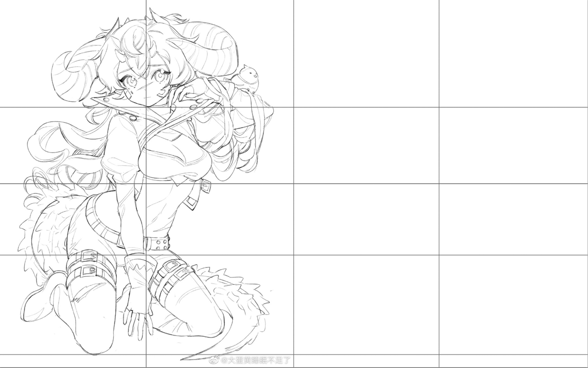
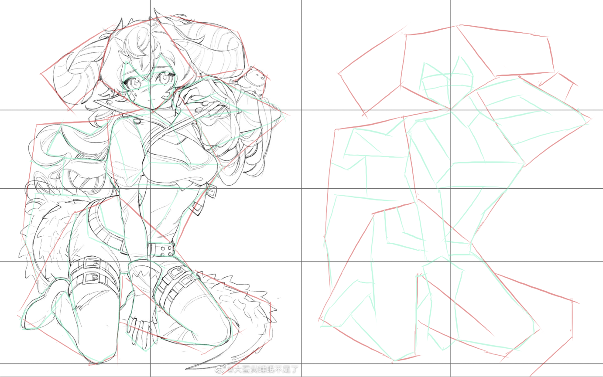
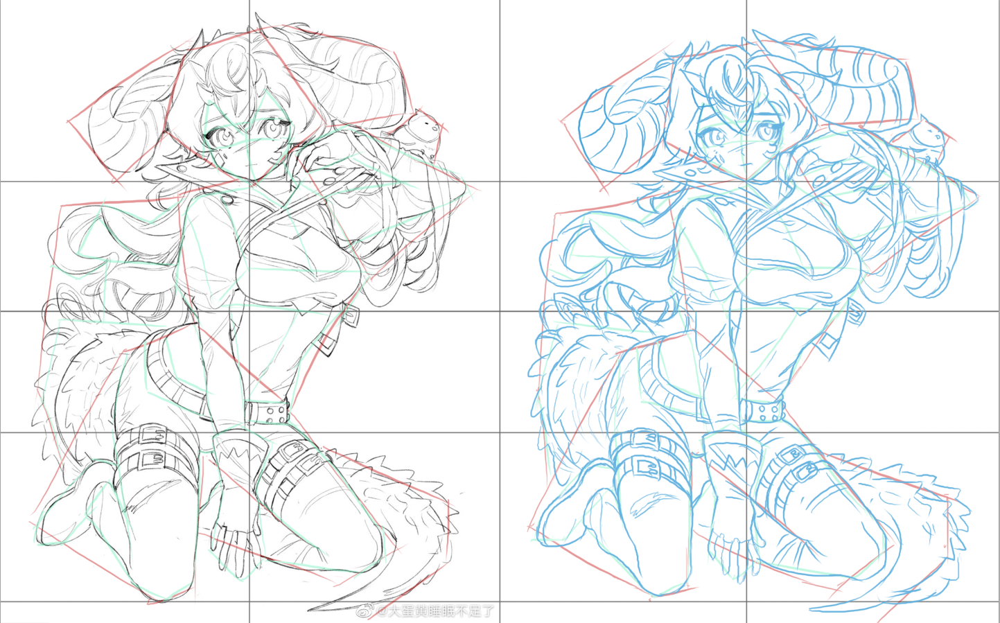

# 绘画笔记

> 绘画思路都是一样的，最重要的是构图技巧和学习方法，不同的是如何选择恰当的工具并熟练使用。

# 板绘

## 方法技巧

- **线稿：画人物线稿需要分成多个图层，明确要上色的结构，线条流畅且闭合，方便快速选择上固有色**
- **框架解构法(比例定位的方法)：把画面分成多个部分，根据部分的复杂程度进行细分**

- 头部设计(**头部画法**)：先定比例上框架，再定风格画五官
- 脸部线稿：十字基准线，三庭五眼
- 腿部上色：填色，二分，光彩，腿部构造
- 衣服上色：褶皱要注意受力分析和光照角度
- 绘画构图设计最重要的是积累参考素材
- 场景透视：近大远小
- 人物构成：五官、头发、身体、服饰、配饰
- 四肢不要在同一直线上

## PS操作

[PS画笔素材](https://gitee.com/link?target=https%3A%2F%2Fbrushes8.com%2F)

[PS素材](https://gitee.com/link?target=https%3A%2F%2Fwww.16sucai.com%2F)

绘画常用

- **线性减淡画高光，正片叠底画阴影**
- **图层蒙板可以将下一个图层作为选定区域**
- 液化和选区变形可以在后期调整画面细微的结构

图像调整

- 高光阴影：图像/调整/阴影/高光
- 色彩平衡：ctrl+B
- 色相/饱和度：ctri+U
- 照片滤镜添加颜色蒙层：图像/调整/照片滤镜
- 色彩范围：配合选区工具中的调整边缘可以分离细节较不明显的两个东西
- 消失点：渲染网格至Photoshop，绘制透视网格

练习示例

- 细节抠图：选择工具选择选区，点击选择/调整边缘，涂抹选区边缘细化。有背景时：新建图层，创建剪切蒙版，设置强光，吸取选区颜色，用画笔涂抹。
- 光照效果：画出选区，shift+F6设置羽化值，alt+Delete填充白色，图层叠加。

# 手绘

## 技巧提示

- 油性彩铅：绘画时要轻涂，多层颜色叠加
- 素描：主要学的是绘画基础，图都具有它的亮度及色彩
- 水粉：绘画时，取原图的几个基础色，用水粉笔混合颜色进行上色
- 轮廓：根据画面结构进行比例分析，用图形进行拼接
- 手绘最重要的是了解工具的特性并运用到合适的地方